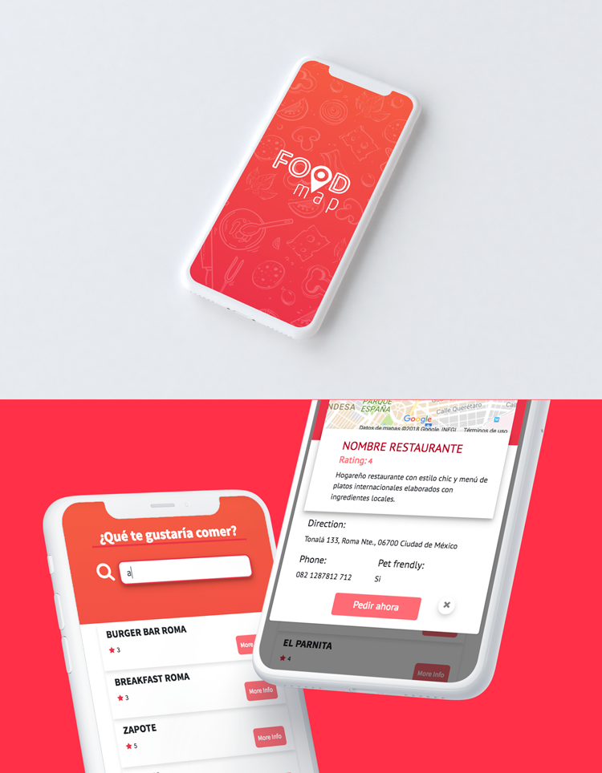

<h1>FOODMAP</h1>

Crear una webapp que funcione como plataforma para ubicar los restaurantes a tu alrededor.

<h3>REQUERIMIENTOS</h3>
- Vista splash de 2 a 5 segundos para la entrada.
- Mapa (ilustrativo o con ubicación actual).
- Filtro de búsqueda.
- Base de datos de restaurantes.

<h3>TOOLS</h3>
- Framework: Bootstrap v.4
- Librería: jquery

